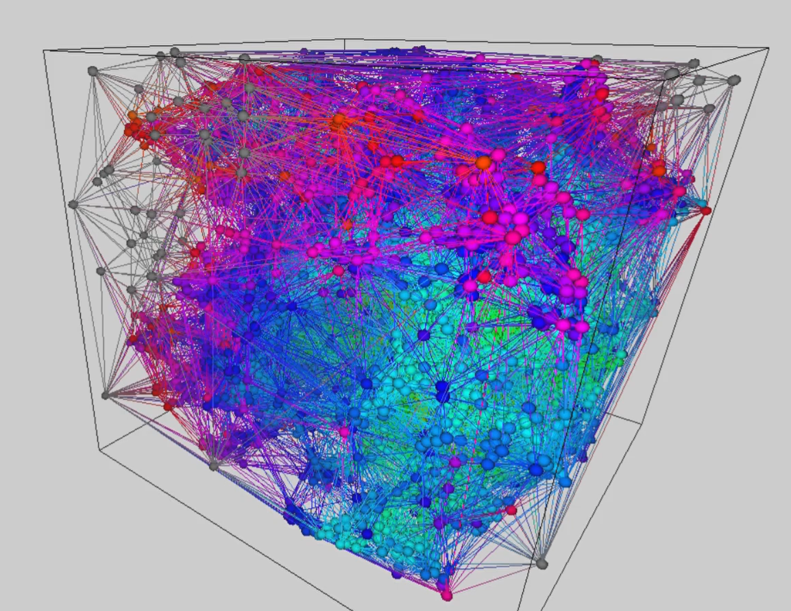

# Neighborhood research using Delaunay tetrahedralization

This project consisted in experimenting methods of finding the nearest points using Delaunay tetrahedralization. 
The different methods are tested with a simulation of Diffusion-limited aggregation and a simulation of 3D Boids. 
This project need Visual Studio 2022 to run.

Project made by Claire Morin and Hugo Bec and supervised by Benoit Crespin and Heinich Porro, in collaboration with XLIM Limoges, France.

Associated report :
- [English](Report_-_Neighborhood_research_using_Delaunay_Tetrahedralization.pdf)
- [Français](Rapport_-_Recherche_de_voisin_par_Tetraédralisation_de_Delaunay.pdf)

[Timelapse of Diffusion-Limited Aggregation using Delaunay tetrahedralization](https://youtu.be/InnPdTIYHTY)

# Parameters
- DSTRUCTURE_VERBOSE: Enable/Disable execution details in the terminal
- TYPE_SIMULATION: Choose between the Diffusion-limited aggregation mode (0) or the Boids mode (1)
- NB_POINT: Choose the number of Particles / Boids
- SPEED_POINTS: Selects the speed of the Particles / Boids
- ATTRACT_RADIUS: Choose their radius of attraction, for the DLA it is preferable to initialize it to \(2 \times SIZE\_OBJECTS\), for the Boids determines its radius of influence \\
- SIZE_OBJECTS: Selects the size of the 3D meshs
- TETRA_REFRESH_RATE: Determines the number of frames before recalculating the Delaunay tetrahedralization
- CAGE_DIM: Determines the size of the cage
- NB_INIT_FIXED_POINTS: Choose the number of fixed points at the start (for Boids must be set to 0)
- BOIDS_SEPARATION_DISTANCE: Determines the average distance between each Boid
- BOIDS_BOX_MARGIN: Determines at what distance from the edge the Boids initiate a turn to return to the cage
- BOIDS_COHESION_FACTOR : Determines the cohesion factor added to each frame
- BOIDS_ALIGNMENT_FACTOR: Determines the alignment factor of the Boids at each frame
- BOIDS_SEPARATION_FACTOR: Determines the Boid separation factor at each frame
- BOIDS_TURN_FACTOR: Determines the turn factor at the edge of the cage that a Boid makes each frame.

# Controls

 - ZQSDRF + mouse: camera
 - +/- : visualize the next/previous point and its attractive points (depends on the radius of attraction)
 - E : display the associated edges of the Delaunay tetrahedralization
 - T : display all the points of the simulation
 - P : pause/play the simulation
 - O : displays only the following frame
 - M : change between the visualization of the attractive points and the visualization of the fixed points
 - B : enables/disables 3D visualization of points (depends on the size of a point)
